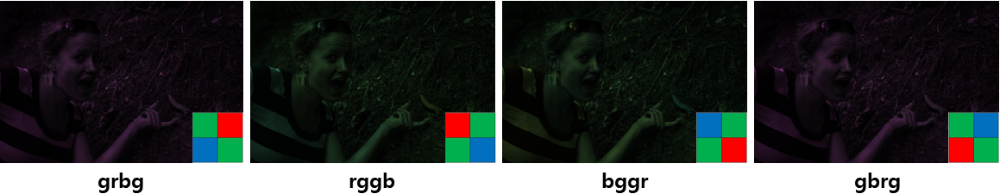

# Homework Assignment 1

<p align='center'>
  
  
  <p align='center'>original image (banana_slug.tiff) 와 final image (.PNG no compression)</p>
</p>

### INITIALS
<p>- Load image, class, size, double</p>

```matlab
%% Problem 1

%A = imread('./data/banana_slug.cr2');
A = imread('./data/banana_slug.tiff');
class(A)
size(A)
trans_A = double(A);
```

- bits per integer the image = uint16
- size = 2856, 4290
- convert the image into a double-precision array

### LINEARIZATION
<p>- value for pixels 2047 -> 0, value 15000 -> 1 로 매핑하기 (min, max)</p>

```matlab
%% Problem 2

% 0 - 16383 => 2047 - 15000
% x < 2047 = 0
% x > 15000 = 16383

min_A = 2047*ones(size(A));
max_A = 15000*ones(size(A));

new_A = max(trans_A, min_A);
new_A = min(new_A, max_A);

new_trans_A = (new_A - 2047)/(15000 - 2047);
```

<p align='center'>
  
</p>

### BAYER PATTERN
- green값이 일반적으로 red나 blue에 비해 intensity data를 많이 가지고 있다고 함
- bayer pattern에서 red, blue보다 green을 많이 샘플링함


```matlab
%% Problem 3

im1=new_trans_A(1:2:end, 1:2:end); %R
im2=new_trans_A(1:2:end, 2:2:end); %G1
im3=new_trans_A(2:2:end, 1:2:end); %G2
im4=new_trans_A(2:2:end, 2:2:end); %B

% ‘grbg’, ‘rggb’, ‘bggr’, ‘gbrg’

im_grbg = cat(3, im2, im1, im3); 
im_rggb = cat(3, im1, im2, im4); 
im_bggr = cat(3, im4, im2, im1); 
im_gbrg = cat(3, im3, im1, im2); 
```

<p align='left'>
  - grbg, rggb, bggr, gbrg bayer pattern을 각각 적용해 비교
</p>
<p align='center'>
  
</p>

<p align='left'>
  - 그 중 rggb 패턴을 적용하여 나온 사진에 intermediate * 5 를 적용한 결과
</p>
<p align='center'>
  
</p>

### WHITE BALANCING
- grey world, white world 두 방법으로 automatic white balancing을 함
- grey world assumption : 전체 씬의 평균 색을 grey로 둠
- white world assumption : 가장 밝은 픽셀(max)을 white로 둠

```matlab
%% Problem 4

grey_r = mean(mean(im_rggb(:,:,1)));
grey_g = mean(mean(im_rggb(:,:,2)));
grey_b = mean(mean(im_rggb(:,:,3)));
im_greyworld = cat(3,im_rggb(:,:,1)*(grey_g/grey_r), im_rggb(:,:,2), im_rggb(:,:,3)*(grey_g/grey_b));
white_r = max(max(im_rggb(:,:,1)));
white_g = max(max(im_rggb(:,:,2)));
white_b = max(max(im_rggb(:,:,3)));
im_whiteworld = cat(3,im_rggb(:,:,1)*(white_g/white_r), im_rggb(:,:,2), im_rggb(:,:,3)*(white_g/white_b));
```

- 옷 줄무늬의 흰 부분을 보았을 때 두 결과의 톤 차이를 조금 명확히 비교할 수 있음 
- white world automatic white balancing 이 더 좋다 판단

<p align='center'>
  
</p>


### DEMOSAICING
- 동일 해상도의 r,g,b를 복원하고자 함
- interp2 function 사용

```matlab
%% Problem 5

di_r = interp2(im_whiteworld(:,:,1));
di_g = interp2(im_whiteworld(:,:,2));
di_b = interp2(im_whiteworld(:,:,3));
im_di = cat(3, di_r, di_g, di_b);
```

<p align='center'>
  </p>


### BRIGHTNESS ADJUSTMENT AND GAMMA CORRECTION
- image는 displays에서 non-linear하기 때문에 명암 차이가 커짐
- gamma correction은 이 non-linear한 특성을 linear하게 바꿈

```matlab
%% Problem 6

if im_di < 0.0031308
    c_non = im_di * 12.92;
else 
    c_non = (1+0.055)*(im_di.^(1/2.4)) - 0.055;
end
```

<p align='center'>
  </p>


### COMPRESSION
- compression ratio (.PNG / .JPEG quality setting 5 ~ 95)

```matlab
%% Problem 7

imwrite(c_non, 'A.png');
imwrite(c_non, 'A_5.jpeg', 'quality', 5);
imwrite(c_non, 'A_10.jpeg', 'quality', 10);
imwrite(c_non, 'A_15.jpeg', 'quality', 15);
imwrite(c_non, 'A_30.jpeg', 'quality', 30);
imwrite(c_non, 'A_50.jpeg', 'quality', 50);
imwrite(c_non, 'A_95.jpeg', 'quality', 95);
```


   <br/>
  
  - white balancing(grey world, white world) 비교 <br/>
    - 원본 cr2 사진과 비교하였을 때, grey world white balancing보다 white world white balancing이 더 좋음을 볼 수 있다.<br/><br/>
  - PNG(no compression), JPEG(compression) <br/>
    - **.PNG** = 14,439,587 byte  <br/>
    - **.JPEG(q;95)** = 2,679,370 byte <br/>
    - compression ratio = 0.18556 <br/>
  

   <br/> 
  - **changing the JPEG quality settings** <br/>
    - **quality 5 (222,342 byte)** : 0.0154<br/>
    - **quality 10 (273,577 byte)** : 0.0189<br/>
    - **quality 15 (321,151 byte)** : 0.0222<br/>
    - **quality 30 (452,203 byte)** : 0.0313<br/>
    - **quality 50 (608,555 byte)** : 0.0421<br/>
    - **quality 95 (2,679,370 byte)** : 0.1856    
